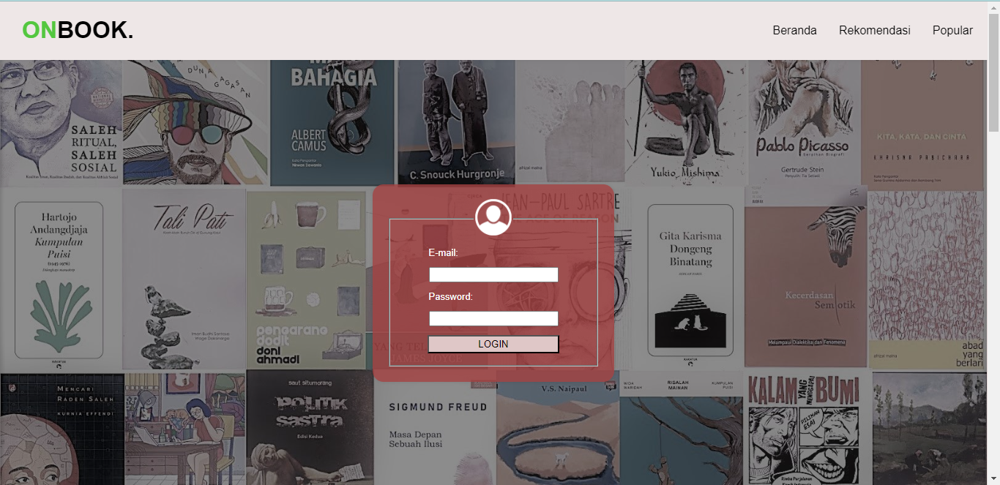
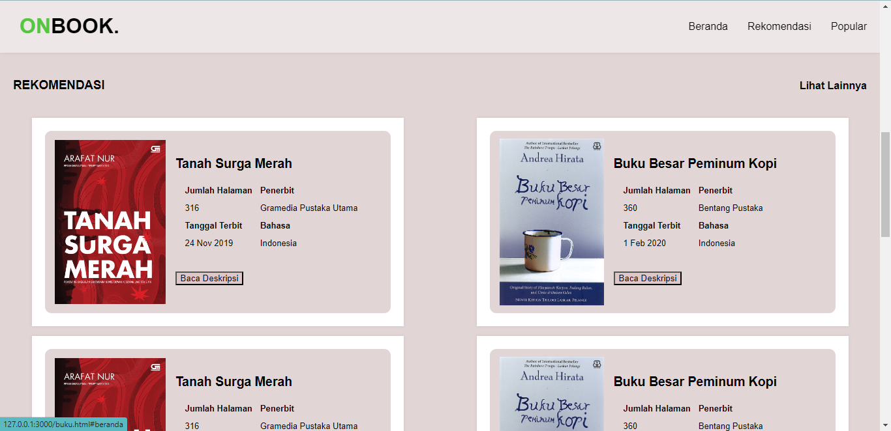
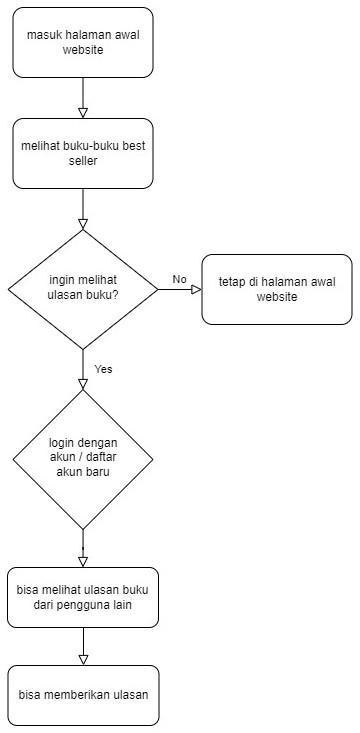
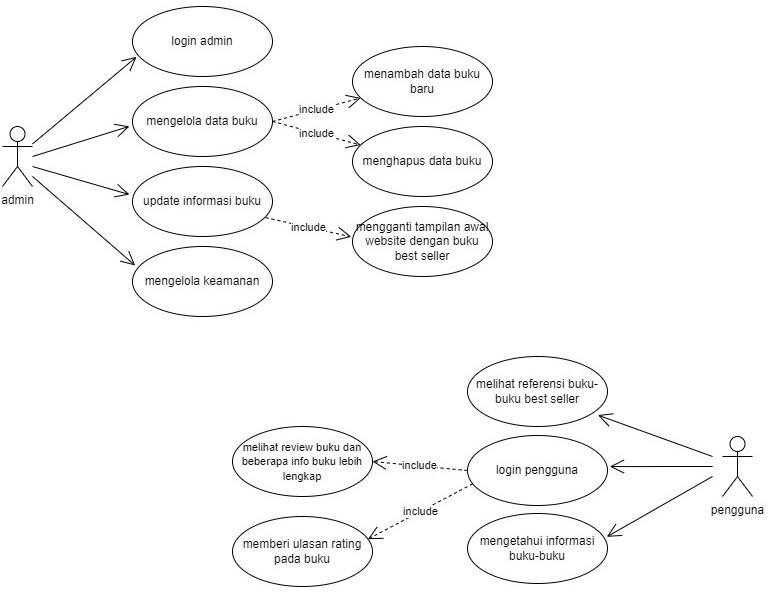

# 2022a-kelompok6

Software Requirements
Specification

for

OnBook Website

Version 1.0 approved

Disusun Oleh :

1. Muhammad Ainur Rofik (22091397005)
2. Farida Muthi’ah Fathin (22091397007)
3. Yunike Shandy Jholan Ninggar (22091397008)

D4 Manajemen Informatika 2022 A Fakultas Vokasi Universitas Negeri Surabaya

Tahun 2023

Copyright © 1999 by Karl E. Wiegers. Permission is granted to use, modify, and distribute this document.

Table of Contents
Table of Contents ii
Revision History ii

1. Introduction 1
   1.1 Purpose 1
   1.2 Document Conventions 1
   1.3 Intended Audience and Reading Suggestions 1
   1.4 Product Scope 1
   1.5 References 1
2. Overall Description 2
   2.1 Product Perspective 2
   2.2 Product Functions 2
   2.3 User Classes and Characteristics 2
   2.4 Operating Environment 2
   2.5 Design and Implementation Constraints 2
   2.6 User Documentation 2
   2.7 Assumptions and Dependencies 3
3. External Interface Requirements 3
   3.1 User Interfaces 3
   3.2 Hardware Interfaces 3
   3.3 Software Interfaces 3
   3.4 Communications Interfaces 3
4. System Features 4
   4.1 System Feature 1 4
   4.2 System Feature 2 (and so on) 4
5. Other Nonfunctional Requirements 4
   5.1 Performance Requirements 4
   5.2 Safety Requirements 5
   5.3 Security Requirements 5
   5.4 Software Quality Attributes 5
   5.5 Business Rules 5
6. Other Requirements 5
   Appendix A: Glossary 5
   Appendix B: Analysis Models 5
   Appendix C: To Be Determined List 6

Revision History

Name Date Reason For Changes Version

1. Introduction

1.1 Purpose

Dokumen ini berisi Software Requirement Specification (SRS). Tujuan dibuatnya dokumen ini yaitu untuk memperjelas pengertian dari website OnBook secara lebih rinci. Dokumen SRS ini juga bertujuan memudahkan pengguna atau audiens untuk lebih mengerti mengenai website SRS yang dibuat. Diharapkan website ini dapat membantu pengguna agar lebih teliti ketika ingin membeli buku, karena website ini akan menjelaskan isi detail setiap jenis buku.

1.2 Document Conventions

1.3 Intended Audience and Reading Suggestions

Dokumen ini dipertunjukkan kepada beberapa pihak, yaitu:
a. Pengguna. Pengguna dapat menggunakan dokumen ini untuk referensi isi website OnBook dan mengetahui rincian website OnBook.
b. Audiens. Audiens yang dituju adalah semua umur dari kecil sampai dewasa. Terutama yang tertarik untuk membeli buku tetapi masih kurang yakin dengan isi bukunya.

1.4 Product Scope

OnBook merupakan website yang dibuat untuk memudahkan pengguna dalam mencari buku yang diinginkan. Pada website ini pengguna dapat mengetahui cover buku dan deskripsi dari buku tersebut. Untuk fitur sendiri terdapat akses login dan beranda, yang mana pada login pengguna harus memasukkan email beserta kata sandinya.

1.5 References

2. Overall Description

2.1 Product Perspective

OnBook merupakan website yang didesain dan dibuat untuk memudahkan pengguna mengetahui buku-buku yang ingin dicari. Pada website OnBook ini setiap buku yang dicari akan menjelaskan deskripsi dari buku tersebut. Pengguna yang akan membeli buku dapat mencari tahu isi buku di website ini. Cara kerja website ini yaitu pengguna hanya perlu login menggunakan email dan passwordnya untuk masuk website agar website bisa berjalan dengan lancar.

2.2 Product Functions

Website ini dikembangkan dengan melakukan beberapa fungsi sebagai berikut:
● Registrasi akun: Fungsi memungkinkan pengguna website OnBook untuk membuat akun dan pengguna dapat mengisi data pribadi seperti Email dan kata sandinya.
● Menampilkan tampilan dan deskripsi buku: Fungsi ini untuk memudahkan pengguna dalam mencari buku yang diinginkan dan mengetahui isi deskripsi buku tersebut.

2.3 User Classes and Characteristics

2.4 Operating Environment

2.5 Design and Implementation Constraints

Kendala yang mungkin terjadi pada website OnBook yaitu:
● Jaringan internet yang tidak stabil. Karena website OnBook ini harus memakai akses internet, ketidakstabilan jaringan dapat mengganggu pengguna dalam menjalankan website ini.
● Kurangnya keamanan. Karena pada website kami diperlukan email dan password email, dikhawatirkan email yang dipakai bisa dibobol oleh pihak yang tidak bertanggung jawab.

2.6 User Documentation

2.7 Assumptions and Dependencies

3. External Interface Requirements

3.1 User Interfaces

3.2 Hardware Interfaces

3.3 Software Interfaces

3.4 Communications Interfaces

3.5 Desain Graphical User Interface
Penjelasan HTML

 
bagian Header untuk mengdefinisikan bagian atas atau bagian kepala dari sebuah web.
Pada header tersebut menggunakan tags: 
<h1> untuk membuat nama web 
 untuk mengelompokkan Sebagian text kemudian diberi warna menggunakan style color.
<nav> digunakan untuk menandai bagian dari sebuah halaman web yang berisi menu navigasi.
<ul> digunakan untuk membuat daftar tak-terurut dari navigasi (unordered list). 
<a> digunakan untuk membuat tautan atau hyperlink. Ini memungkinkan Anda untuk menghubungkan halaman web atau sumber daya lain dengan halaman web saat ini.
 

Pada bagian halaman Login menggunakan tags:

 untuk membuat container box pada halaman web.
 untuk menampilkan gambar pada web dengan menentukan sumber gambar dengan atribut src yang mengacu pada URL atau path file gambar.
<fieldset> digunakan untuk mengelompokkan beberapa elemen formulir dalam satu kerangka, seperti digunakan untuk form login yang berisikan E-mail dan Password.
<legend> digunakan sebagai judul atau keterangan untuk elemen formulir yang ada dalam <fieldset>.
<tabel> untuk membuat tabel pada halaman web yang dimana dalam tabel tersebut digunakan untuk menampilkan dan Menyusun dalam bentuk baris dan kolom.
<tr> digunakan untuk mendefinisikan baris dalam tabel.
<th> digunakan untuk mendefinisikan sel header dalam tabel. Sel header digunakan untuk memberikan informasi tambahan tentang konten di dalam sel-sel yang terkait di baris atau kolom yang sama.
<td> digunakan untuk mendefinisikan sela tau elemen data dalam tabel.
<button> digunakan untuk membuat tombol yang dapat digunakan oleh pengguna, dapat berupa pengiriman formulir atau pun tidakan lainnya yang ingin dilakukan dalam halaman web.
<h2> digunakan untuk menandai judul dengan ketebalan tingkat 2.
<h3> digunakan untuk menandai judul dengan ketebalan tingkat 3.

Penjelasan CSS
 
Pada selector header berisi atribut :
background-color: Properti ini mengatur warna latar belakang header.
color: Properti ini mengatur warna teks dalam header.
padding-left: 30px;: Properti ini menambahkan jarak padding 30 piksel di sisi kiri elemen header. Ini dapat memberikan ruang kosong di sebelah kiri konten dalam header.
width: 100%;: Properti ini membuat header mengambil seluruh lebar halaman, sehingga header akan memenuhi lebar layar sepenuhnya.
display: flex;: Ini mengatur header sebagai kontainer tampilan fleksibel, yang memungkinkan Anda untuk mengatur elemen-elemen anak di dalamnya dengan lebih fleksibel menggunakan CSS properti justify-content dan align-items.
position: fixed;: Ini membuat header menjadi elemen yang ditempel di bagian atas jendela browser saat pengguna menggulir ke bawah. Dengan kata lain, header akan tetap terlihat bahkan ketika menggulir halaman.
justify-content: space-between;: Ini mengatur elemen-elemen anak di dalam header untuk diberi jarak di antara mereka sehingga ada ruang kosong di sekitar elemen-elemen header. Elemen-elemen anak akan terpisah secara merata dengan elemen-elemen di sisi kiri dan kanan header.
align-items: center;: Properti ini memusatkan elemen-elemen anak vertikal di dalam header. Ini memastikan elemen-elemen anak berada di tengah header secara vertikal.
box-shadow: Properti ini menambahkan bayangan (shadow) halus pada header. Bayangan ini memberikan efek tiga dimensi pada elemen header.
z-index: 9999;: Properti ini mengatur urutan tumpukan elemen (z-index) untuk header. Dengan nilai 9999, header akan tumpang tindih di atas elemen-elemen lain yang memiliki z-index lebih rendah.
 
Selektor ini digunakan untuk mengatur letak navigasi pada tags <nav>, didalam nya terdapat atribut:
display: flex;: Properti ini mengatur elemen-elemen yang memiliki kelas .navbar sebagai kontainer tampilan fleksibel. Ini memungkinkan Anda untuk mengatur elemen-elemen anak di dalamnya dengan lebih fleksibel menggunakan CSS properti justify-content, align-items, dan lainnya yang berkaitan dengan fleksibilitas. 
padding-right: 50px;: Properti ini menambahkan jarak padding sebanyak 50 piksel di sebelah kanan elemen-elemen yang memiliki kelas .navbar. Ini dapat memberikan ruang kosong di sebelah kanan elemen-elemen tersebut.
 
Selektor ini digunakan untuk mengatur beberapa tampilan untuk halaman web, didalam nya berisi atribut:
font-family: Arial, sans-serif;: Properti ini mengatur jenis font yang akan digunakan untuk teks dalam elemen <body>. 
margin: 0;: Properti ini menghapus margin bawaan (ruang putih) yang ada pada elemen <body>. Biasanya, browser memberikan margin default untuk elemen <body>, dan aturan ini mengaturnya menjadi nol, sehingga halaman dimulai dari sudut kiri atas viewport tanpa ruang putih tambahan.
background-color: Properti ini mengatur warna latar belakang elemen <body>. 
 
list-style-type: none;: Properti ini menghilangkan tanda listing (bullet atau numbering) yang biasanya muncul di depan elemen-elemen daftar. Ini umumnya digunakan untuk mengubah daftar menjadi daftar tanpa tanda.
display: flex;: Properti ini mengubah elemen <ul> menjadi sebuah kontainer fleksibel, yang memungkinkan pengaturan item daftar secara horizontal (sejajar) atau vertikal (bertumpuk), tergantung pada pengaturan kontainer. Ini sangat berguna untuk membuat menu navigasi horisontal di navbar.
gap: 30px;: Properti ini menentukan jarak (spacing) antara item daftar dalam kontainer fleksibel. Nilai 30px menentukan jarak sebesar 30 piksel antara item-item tersebut. Ini dapat membantu menciptakan ruang antara tautan navigasi dalam navbar Anda.
 
text-decoration: none;: Properti ini menghilangkan dekorasi tautan bawaan seperti garis bawah (underline) atau garis tepi (border) yang biasanya terlihat pada tautan. Dalam hal ini, itu menghapus garis bawah dari tautan, sehingga tautan akan terlihat sebagai teks biasa tanpa dekorasi tambahan.
color: #000000;: Properti ini mengatur warna teks tautan menjadi hitam (#000000). Anda dapat mengganti nilai warna sesuai dengan preferensi desain Anda.
font-size: 16px;: Properti ini mengatur ukuran font untuk teks tautan menjadi 16 piksel. Anda dapat mengubah ukuran font sesuai dengan preferensi desain Anda.
 
a:hover: Ini adalah pseudo-class CSS yang digunakan untuk menentukan tampilan tautan saat kursor berada di atasnya.
color: Properti ini mengubah warna teks tautan saat kursor berada di atas tautan.
 
Selektor ini digunakan untuk mengatur tampilan pada container buku bagian pertama dengan menggunakan atribut:
width: 550px;: Properti ini mengatur lebar elemen .containerbook menjadi 550 piksel.
height: 300px;: Properti ini mengatur tinggi elemen .containerbook menjadi 300 piksel.
margin: 0px auto;: Properti ini mengatur margin elemen .containerbook secara horizontal menjadi nol (0px) dan secara vertikal menjadi "auto." Ini memposisikan elemen di tengah horizontal dari parentnya, biasanya di tengah tampilan browser.
padding: 10px;: Properti ini menambahkan jarak padding sebanyak 10 piksel di sekeliling elemen .containerbook. Padding adalah ruang kosong antara batas elemen dan kontennya.
background-color: Properti ini mengatur warna latar belakang elemen .containerbook. 
box-shadow: Properti ini menambahkan efek bayangan lembut ke elemen .containerbook. Bayangan ini memberikan elemen efek tiga dimensi.
 
Selektor ini digunakan untuk mengatur tampilan pada container buku bagian kedua dengan menggunakan atribut:
align-items: center;: Properti ini mengatur penempatan elemen-elemen anak secara vertikal di tengah elemen yang memiliki kelas .containerbook2.
width: 515px;: Properti ini mengatur lebar elemen .containerbook2 menjadi 515 piksel.
height: 280px;: Properti ini mengatur tinggi elemen .containerbook2 menjadi 280 piksel.
margin-top: 10px;, margin-bottom: 10px;, margin-left: 10px;, margin-right: 10px;: Properti-properti margin ini menentukan jarak margin elemen .containerbook2 dari sisi-sisi tertentu. Dalam hal ini, elemen akan memiliki margin 10 piksel di semua sisi (atas, bawah, kiri, dan kanan).
padding-left: 15px;: Properti ini menambahkan jarak padding 15 piksel di sisi kiri elemen .containerbook2. Padding adalah ruang kosong antara batas elemen dan kontennya.
display: flex;: Ini mengatur .containerbook2 sebagai kontainer tampilan fleksibel, yang memungkinkan Anda untuk mengatur elemen-elemen anak di dalamnya dengan lebih fleksibel menggunakan CSS properti justify-content, align-items, dan lainnya yang berkaitan dengan fleksibilitas.
background-color: Properti ini mengatur warna latar belakang elemen .containerbook2.
border-radius: 10px;: Properti ini memberikan elemen sudut lengkung dengan radius 10 piksel, sehingga elemen memiliki tepi yang lembut dan tidak tajam.
 
Selektor ini digunakan untuk mengatur elemen tabel agar terletak ditengah dengan menggunakan atribut:
margin: 0 auto;: Properti ini mengatur elemen dengan class .centertabel menjadi berada di tengah secara horizontal dengan menggunakan margin otomatis. Ini umumnya digunakan untuk mengatur tata letak tengah untuk elemen-elemen yang memiliki lebar yang telah ditentukan.
border: 0px solid black;: Properti ini mengatur elemen dengan class .centertabel untuk memiliki batas (border) dengan ketebalan 0 piksel, sehingga tidak akan ada garis batas yang terlihat.
 
Selektor ini digunakan untuk mengatur bentuk latar belakang pada form login dengan menggunakan atribut:
width: 290px;: Properti ini mengatur lebar elemen dengan kelas .containerform menjadi 290 piksel.
height: 230px;: Properti ini mengatur tinggi elemen dengan kelas .containerform menjadi 230 piksel.
margin: 20px auto;: Properti ini mengatur elemen .containerform untuk berada di tengah secara horizontal dengan margin atas dan bawah sebanyak 20 piksel dan margin otomatis di sisi kiri dan kanan.
padding: 20px;: Properti ini menambahkan jarak padding sebanyak 20 piksel di sekeliling elemen .containerform. Padding adalah ruang kosong antara batas elemen dan kontennya.
border-radius: 15px;: Properti ini memberikan elemen sudut lengkung dengan radius 15 piksel, sehingga elemen memiliki tepi yang lembut dan tidak tajam.
background-color: Properti ini mengatur warna latar belakang elemen .containerform. 
box-shadow: Properti ini menambahkan efek bayangan lembut ke elemen .containerform. Bayangan ini memberikan elemen efek tiga dimensi.

 
Selektor ini digunakan untuk mengatur letak susunan buku pada halaman buku dengan menggunakan atribut:
display: flex;: Properti ini mengatur elemen-elemen dengan kelas .halamanbuku sebagai kontainer tampilan fleksibel (flex container). Ini memungkinkan Anda untuk mengatur elemen-elemen anak di dalamnya dengan lebih fleksibel menggunakan properti seperti justify-content, align-items, dan lainnya yang berkaitan dengan fleksibilitas.
flex-wrap: wrap;: Properti ini digunakan bersama dengan display: flex; dan mengatur elemen-elemen anak agar dapat melintasi baris (wrap) jika ruang horizontal tidak mencukupi.
gap: 15px;: Properti ini menambahkan jarak (spacing) sebesar 15 piksel antara elemen-elemen anak di dalam kontainer .halamanbuku
 
Selektor ini digunakan untuk mengatur letak judul halaman pada halaman buku dengan menggunakan atribut:
display: flex;: Properti ini mengubah elemen yang memiliki kelas .judulhalaman menjadi sebuah kontainer fleksibel
justify-content: space-between;: Properti ini digunakan untuk mengatur cara elemen-elemen di dalam kontainer flex ditempatkan secara horizontal.
padding-left: 20px;: Properti ini menambahkan jarak padding sebanyak 20 piksel di sisi kiri elemen dengan kelas .judulhalaman. Padding adalah ruang kosong antara batas elemen dan kontennya.
padding-top: 20px;: Properti ini menambahkan jarak padding sebanyak 20 piksel di sisi kanan elemen.
padding-top: 100px;: Properti ini menambahkan jarak padding sebanyak 100 piksel di sisi atas elemen.
padding-bottom: 20px;: Properti ini menambahkan jarak padding sebanyak 20 piksel di sisi bawah elemen.
 
Selektor ini digunakan untuk mengatur bentuk button login dengan menggunakan atribut:
background-color: Properti ini mengatur warna latar belakang elemen dengan kelas .btnlogin. 
width: 180px;: Properti ini mengatur lebar elemen .btnlogin menjadi 180 piksel.
height: 25px;: Properti ini mengatur tinggi elemen .btnlogin menjadi 25 piksel.
 
Selektor ini digunakan untuk mengatur bentuk button baca deskripsi yang berada didalam container buku dengan menggunakan atribut:
background-color: Properti ini mengatur warna latar belakang elemen dengan kelas .btn.
  
Selektor ini digunakan untuk mendefinisikan elemen yang digunakan dibagian akhir web, dengan menggunakan atribut:
width: 1248px;: Properti ini mengatur lebar elemen .footer menjadi 1248 piksel.
padding: 50px;: Properti ini menambahkan jarak padding sebanyak 50 piksel di sekeliling elemen .footer. Ini akan memberikan elemen footer lebih banyak ruang kosong di sekeliling kontennya.
margin-top: 40px;: Properti ini mengatur margin atas elemen .footer sebanyak 40 piksel. Margin atas akan memberikan jarak antara elemen ini dan elemen di atasnya.
background-color: Properti ini mengatur warna latar belakang elemen .footer menjadi merah muda dengan tingkat transparansi tertentu.
box-shadow: Properti ini menambahkan efek bayangan lembut ke elemen .footer. Bayangan ini memberikan elemen efek tiga dimensi.
 
Selektor ini digunakan untuk membuat lapisan latar belakang yang menutupi seluruh halaman dengan menggunakan atribut:
position: absolute;: Properti ini mengatur elemen-elemen dengan kelas .overlay dalam posisi absolut, yang berarti elemen ini ditempatkan sesuai dengan elemen yang terdekat dengan posisi relatif.
top: 0;: Properti ini mengatur elemen .overlay untuk berada di bagian atas elemen yang memiliki posisi relatif terdekat.
left: 0;: Properti ini mengatur elemen .overlay untuk berada di sisi kiri elemen yang memiliki posisi relatif terdekat.
width: 1348px;: Properti ini mengatur lebar elemen .overlay menjadi 1348 piksel.
height: 700px;: Properti ini mengatur tinggi elemen .overlay menjadi 700 piksel.
color: rgb(255, 255, 255);: Properti ini mengatur warna teks dalam elemen .overlay menjadi putih (kode warna dalam format RGB).
align-items: center;: Properti ini mencoba mengatur penempatan elemen-elemen anak secara vertikal di tengah elemen .overlay. Namun, untuk menggunakan align-items, elemen .overlay harus memiliki tampilan fleksibel (flexbox).
padding: 230px;: Properti ini menambahkan jarak padding sebanyak 230 piksel di sekeliling elemen .overlay. Padding adalah ruang kosong antara batas elemen dan kontennya.
box-sizing: border-box;: Properti ini mengubah model kotak elemen .overlay menjadi model kotak "border-box."
 
Selektor tabel digunakan untuk mengatur tata letak tabel pada web, didalam nya menggunakan atribut:
border-collapse: collapse;: Properti ini mengatur perilaku tabel untuk menggunakan model penyatuan batas (collapsed borders). Ini berarti batas sel dalam tabel akan terlihat sebagai satu garis saja, dan tidak akan ada jarak antara sel.
margin: 10px 9px 30px;: Properti ini mengatur jarak margin elemen-elemen tabel.
 
Selektor ini digunakan untuk mengatur tampilan header tabel pada web, didalam nya menggunakan atribut:
border: 0px solid #000000;: Properti ini mengatur elemen-elemen <th> untuk tidak memiliki batas (border) dan ketebalan batasnya adalah 0 piksel.
padding: 6px;: Properti ini menambahkan jarak padding sebanyak 6 piksel di sekeliling elemen-elemen <th>. Padding adalah ruang kosong antara batas elemen dan kontennya.
text-align: left;: Properti ini mengatur teks dalam elemen-elemen <th> untuk dipojok kiri.
 
Selektor tabel digunakan untuk mengatur tampilan kolom data tabel pad web, didalam nya menggunakan atribut:
border: 0px solid #000000;: Properti ini mengatur elemen-elemen <td> untuk tidak memiliki batas (border) dan ketebalan batasnya adalah 0 piksel.
font-size: small;: Properti ini mengatur ukuran font elemen-elemen <td> menjadi ukuran font "small."
padding: 6px;: Properti ini menambahkan jarak padding sebanyak 6 piksel di sekeliling elemen-elemen <td>. Padding adalah ruang kosong antara batas elemen dan kontennya.
text-align: left;: Properti ini mengatur teks dalam elemen-elemen <td> untuk dipojok kiri.
 

  

4. System Features
   
4.1 System Feature 1

4.1.1 Description and Priority

4.1.2 Stimulus/Response Sequences

4.1.3 Functional Requirements

4.2 System Feature 2 (and so on)

5. Other Nonfunctional Requirements

5.1 Performance Requirements

5.2 Safety Requirements

5.3 Security Requirements

5.4 Software Quality Attributes

5.5 Business Rules

6. Other Requirements

Appendix A: Glossary

Appendix B: Analysis Models

Flowchart

Use Case Diagram

Appendix C: To Be Determined List

Untuk daftar yang akan ditentukan ada beberapa yang akan dikembangkan, yaitu:

1. Kami akan mengembangkan website OnBook ini dengan menambahkan beberapa fitur untuk lebih mempermudah pengguna.
2. Kami akan memperbaiki tampilan pada website agar lebih menarik.
3. Menambah akses keamanan data pengguna yang sudah pernah login ke website OnBook.
