# 2022a-kelompok6

Software Requirements
Specification

for

OnBook Website

Version 1.0 approved

Disusun Oleh :

1. Muhammad Ainur Rofik (22091397005)
2. Farida Muthi’ah Fathin (22091397007)
3. Yunike Shandy Jholan Ninggar (22091397008)

D4 Manajemen Informatika 2022 A Fakultas Vokasi Universitas Negeri Surabaya

Tahun 2023

**1. Introduction**
Pada era revolusi industri 5.0 ini banyak teknologi yang berkembang di berbagai daerah, terutama perkembangan pada design dan website. Contoh perkembangan teknologi pada bidang desain sendiri yaitu seperti adanya aplikasi-aplikasi mengenai colour pallet dan ada juga aplikasi yang menyediakan objek gambar untuk akses pengeditan dan masih banyak lagi. Kemudian pada website sendiri banyak dipakai oleh orang untuk mempermudah mereka untuk pencarian sesuatu lebih cepat. Banyak fungsi website yang dikembangkan pada era ini, seperti model tampilan yang dipercantik, banyak fitur baru yang ditambahkan, kemudian juga mempermudah user dalam mengakses website tersebut. Di sini kami membuat website dengan nama OnBook. Tujuan kami membuat website ini yaitu untuk membantu user agar lebih mudah dalam mencari toko penjual buku yang dicari oleh user itu sendiri. 
 Website ini menjelaskan tentang penjualan buku yang mungkin ada pada toko-toko buku yang tersambung atau sudah bekerja sama dengan website kami. Yang mana website kami akan memberitahukan informasi tentang buku yang dicari oleh user, kemudian website OnBook akan menampilkan buku-buku dan harga pada buku tersebut, setelah itu akan ditunjukkan rekomendasi toko-toko yang menjual buku yang dicari. Pada awalnya website kami hanya dirancang secara sederhana hanya untuk menampilkan harga buku-buku yang ada, namun setelahnya dirubah menjadi lebih kompleks dan juga lebih rapi. Di sini juga ditambahkan fitur untuk menampilkan toko yang berjualan buku yang dicari untuk mempermudah user.

1.1 Purpose

Dokumen ini berisi Software Requirement Specification (SRS). Tujuan dibuatnya dokumen ini yaitu untuk memperjelas pengertian dari website OnBook secara lebih rinci. Dokumen SRS ini juga bertujuan memudahkan pengguna atau audiens untuk lebih mengerti mengenai website SRS yang dibuat. Diharapkan website ini dapat membantu pengguna agar lebih teliti ketika ingin membeli buku, karena website ini akan menjelaskan isi detail setiap jenis buku.

1.2 Document Conventions
Di sini akan dijelaskan mengenai singkatan dan pengertian dari file juga istilah yang berhubungan dengan website yang dibuat. Berikut konversi dokumen yang kami gunakan pada website OnBook:
- Software : Perangkat lunak yang berisikan data atau file yang dapat disimpan, dibuka, dan dibaca pada komputer.
- Website : Yaitu halaman informasi yang disediakan melalui jalur internet yang bisa diakses oleh seluruh dunia selama terkoneksi dengan internet.
- Domain : Alamat website, yaitu dapat mengantarkan kita ke alamat website yang dituju.
- Server : Merupakan sistem komputer yang memiliki layanan khusus berupa penyimpanan data.
- HTML : Hypertext Markup Language merupakan bahasa yang digunakan untuk membuat struktur website ini.
- CSS : Cascading Style Sheet yaitu bahasa yang digunakan untuk mengatur tampilan website OnBook ini.
Format penulisan pada dokumen SRS ini menggunakan font Arial dengan spasi 1 berwarna hitam. Prioritas dari website “OnBook” ini adalah untuk memberikan informasi kepada pembaca mengenai buku-buku, seperti novel, komik, ensiklopedia, pengetahuan, dan lain sebagainya. Website ini akan memberikan ulasan buku yang disediakan informatif, terstruktur dengan baik, dan ditulis dengan gaya bahasa yang menarik.

1.3 Intended Audience and Reading Suggestions

Dokumen ini dipertunjukkan kepada beberapa pihak, yaitu:
- Pengguna. Pengguna dapat menggunakan dokumen ini untuk referensi isi website OnBook dan mengetahui rincian website OnBook. Pengguna yang dituju yaitu semua orang yang memiliki smartphone dan yang ingin mengetahui harga buku di toko-toko yang menjualnya (biasanya anak-anak, remaja atau orang dewasa).
- Audiens. Audiens yang dituju adalah semua umur dari kecil sampai dewasa. Terutama yang tertarik untuk membeli buku tetapi masih kurang yakin dengan isi bukunya dan kebingungan dimana untuk membeli buku dimana.

1.4 Product Scope

OnBook merupakan website yang dibuat untuk memudahkan pengguna dalam mencari buku yang diinginkan. Pada website ini pengguna dapat mengetahui cover buku dan deskripsi dari buku tersebut. Untuk fitur sendiri terdapat akses login dan beranda, yang mana pada login pengguna harus memasukkan email beserta kata sandinya.

**2. Overall Description**

2.1 Product Perspective

OnBook merupakan website yang didesain dan dibuat untuk memudahkan pengguna mengetahui buku-buku yang ingin dicari. Pada website OnBook ini setiap buku yang dicari akan menjelaskan deskripsi dari buku tersebut. Pengguna yang akan membeli buku dapat mencari tahu isi buku di website ini. Cara kerja website ini yaitu pengguna hanya perlu login menggunakan email dan passwordnya untuk masuk website agar website bisa berjalan dengan lancar.

2.2 Product Functions

Website ini dikembangkan dengan melakukan beberapa fungsi sebagai berikut:
● Registrasi akun: Fungsi memungkinkan pengguna website OnBook untuk membuat akun dan pengguna dapat mengisi data pribadi seperti Email dan kata sandinya.
● Menampilkan tampilan dan deskripsi buku: Fungsi ini untuk memudahkan pengguna dalam mencari buku yang diinginkan dan mengetahui isi deskripsi buku tersebut.

2.3 User Classes and Characteristics
Hak Akses dari Website OnBook adalah sebagai berikut:
- Admin : Hak akses pada setiap data yang ada. Mendata email beserta kata sandi yang sudah masuk pada website.
- Pengguna : Mengisi ketentuan seperti email dan kata sandi pada halaman login. Memberikan ulasan ke website OnBook. Melihat rekomendasi buku dan toko penjual buku.

2.4 Operating Environment
Website OnBook dapat beroperasi berdasarkan spesifikasi sebagai berikut:
- Dapat diakses selama 24 jam
- Tidak adanya ketentuan minimal RAM pada laptop atau smartphone
- Bisa diakses kapan saja dan dimana saja asalkan terhubung dengan internet yang baik

2.5 Design and Implementation Constraints
Kendala yang mungkin terjadi pada website OnBook yaitu:
- Jaringan internet yang tidak stabil. Karena website OnBook ini harus memakai akses internet, ketidakstabilan jaringan dapat mengganggu pengguna dalam menjalankan website ini.
- Kurangnya keamanan. Karena pada website kami diperlukan email dan password email, dikhawatirkan email yang dipakai bisa dibobol oleh pihak yang tidak bertanggung jawab.

2.6 User Documentation
   Website OnBook berbasis dalam jaringan online, sehingga dapat diakses seluruh dunia selama terhubung di internet juga untuk membantu pengguna dalam mencari buku dan menemukan toko penjual buku. Website OnBook juga menyediakan fitur ulasan, jadi untuk pengguna yang sudah mampir ke website ini dapat memberikan ulasannya kepada website ini.
   
2.7 Assumptions and Dependencies
Website OnBook ini mempunyai dua interface. Yang pertama yaitu dapat dikunjungi oleh admin. Di sini admin memiliki hak akses untuk melihat dan juga mengelola semua data-data dari user. Semisal terjadi hal yang mencurigakan d dalm data, admin dapat menindaklanjuti hal tersebut. Interface yang selanjutnya yaitu tampilan halaman website OnBook bagi para user. Di sini user memiliki hak akses pada segala hal yang sudah disediakan dalam web OnBook sendiri. Seperti pencarian buku, rekomendasi, toko, dan lain sebagainya.

**3. External Interface Requirements**

3.1 User Interfaces

   Antarmuka pengguna yang ada pada website OnBook adalah sebagai berikut:
      1. Beranda: Pada halaman beranda ini, terdapat menu login untuk pengguna
      2. Rekomendasi: Halaman ini menampilkan beberapa buku rekomendasi yang disarankan kepada pengguna
      3. Popular: Halaman ini akan menampilkan buku-buku yang sedang popular

3.2 Hardware Interfaces

   Website Onbook didukung pada SmartPhone maupun PC yang terhubung dengan jaringan internet. Perangkat keras lainya yang mendukung pengaksesan website OnBook dapat dijelaskan seperti berikut:
      1. SmartPhone/PC : Untuk mengakses website OnBook
      2. Monitor : Menampilkan halaman website OnBook
      3. Keyboard : Untuk memasukkan input ke website OnBook
      4. Mouse : Untuk mempermudah navigasi pengguna

3.3 Software Interfaces

   Kebutuhan antarmuka perangkat lunak sangat dibutuhkan untuk membuat websie OnBook. Berikut adalah beberapa hal yag dibutuhkan untuk membuat website OnBook:
      1. HTML: HTML digunakan untuk mendefinisikan struktur dasar halaman web, menyusun teks, paragraf, daftar, dan elemen-elemen teks lainnya, serta untuk menghubungkan halaman web dan membentuk struktur navigasi.
      2. CSS : CSS digunakan untuk mengubah tampilan elemen-elemen HTML, termasuk warna latar belakang, teks, font, dan border.

3.4 Communications Interfaces

   Website OnBok membutuhkan laptop, PC, maupun SmartPhone yang tersambung ke internet.

3.5 Desain Graphical User Interface

\*Penjelasan HTML

bagian Header untuk mengdefinisikan bagian nama dan navigasi dari web.
Pada header tersebut menggunakan tags

1. **h1** untuk membuat nama web
2. **span** untuk mengelompokkan Sebagian text kemudian diberi warna menggunakan style color.
3. **nav** digunakan untuk menandai bagian dari sebuah halaman web yang berisi menu navigasi.
4. **ul** digunakan untuk membuat daftar tak-terurut dari navigasi (unordered list).
5. **a** digunakan untuk membuat tautan atau hyperlink. Ini memungkinkan Anda untuk menghubungkan halaman web atau sumber daya lain dengan halaman web saat ini.

Pada bagian halaman Login menggunakan tags

1. **div** untuk membuat container box pada halaman web.
2. **Img** untuk menampilkan gambar pada web dengan menentukan sumber gambar dengan atribut src yang mengacu pada URL atau path file gambar.
3. **fieldset** digunakan untuk mengelompokkan beberapa elemen formulir dalam satu kerangka, seperti digunakan untuk form login yang berisikan E-mail dan Password.
4. **legend** digunakan sebagai judul atau keterangan untuk elemen formulir yang ada dalam <fieldset>.
5. **tabel** untuk membuat tabel pada halaman web yang dimana dalam tabel tersebut digunakan untuk menampilkan dan Menyusun dalam bentuk baris dan kolom.
6. **tr** digunakan untuk mendefinisikan baris dalam tabel.
7. **th** digunakan untuk mendefinisikan sel header dalam tabel. Sel header digunakan untuk memberikan informasi tambahan tentang konten di dalam sel-sel yang terkait di baris atau kolom yang sama.
8. **td** digunakan untuk mendefinisikan sela tau elemen data dalam tabel.
9. **button** digunakan untuk membuat tombol yang dapat digunakan oleh pengguna, dapat berupa pengiriman formulir atau pun tidakan lainnya yang ingin dilakukan dalam halaman web.
10. **h2** digunakan untuk menandai judul dengan ketebalan tingkat 2.
11. **h3** digunakan untuk menandai judul dengan ketebalan tingkat 3.

\*Penjelasan CSS

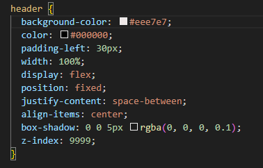

Pada selector header berisi atribut :

1. background-color: Properti ini mengatur warna latar belakang header.
2. color: Properti ini mengatur warna teks dalam header.
3. padding-left: 30px;: Properti ini menambahkan jarak padding 30 piksel di sisi kiri elemen header. Ini dapat memberikan ruang kosong di sebelah kiri konten dalam header.
4. width: 100%;: Properti ini membuat header mengambil seluruh lebar halaman, sehingga header akan memenuhi lebar layar sepenuhnya.
5. display: flex;: Ini mengatur header sebagai kontainer tampilan fleksibel, yang memungkinkan Anda untuk mengatur elemen-elemen anak di dalamnya dengan lebih fleksibel menggunakan CSS properti justify-content dan align-items.
6. position: fixed;: Ini membuat header menjadi elemen yang ditempel di bagian atas jendela browser saat pengguna menggulir ke bawah. Dengan kata lain, header akan tetap terlihat bahkan ketika menggulir halaman.
7. justify-content: space-between;: Ini mengatur elemen-elemen anak di dalam header untuk diberi jarak di antara mereka sehingga ada ruang kosong di sekitar elemen-elemen header. Elemen-elemen anak akan terpisah secara merata dengan elemen-elemen di sisi kiri dan kanan header.
8. align-items: center;: Properti ini memusatkan elemen-elemen anak vertikal di dalam header. Ini memastikan elemen-elemen anak berada di tengah header secara vertikal.
9. box-shadow: Properti ini menambahkan bayangan (shadow) halus pada header. Bayangan ini memberikan efek tiga dimensi pada elemen header.
10. z-index: 9999;: Properti ini mengatur urutan tumpukan elemen (z-index) untuk header. Dengan nilai 9999, header akan tumpang tindih di atas elemen-elemen lain yang memiliki z-index lebih rendah.

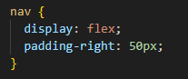

\*Selektor ini digunakan untuk mengatur letak navigasi pada tags <nav>, didalam nya terdapat atribut:

1. display: flex;: Properti ini mengatur elemen-elemen yang memiliki kelas .navbar sebagai kontainer tampilan fleksibel. Ini memungkinkan Anda untuk mengatur elemen-elemen anak di dalamnya dengan lebih fleksibel menggunakan CSS properti justify-content, align-items, dan lainnya yang berkaitan dengan fleksibilitas.
2. padding-right: 50px;: Properti ini menambahkan jarak padding sebanyak 50 piksel di sebelah kanan elemen-elemen yang memiliki kelas .navbar. Ini dapat memberikan ruang kosong di sebelah kanan elemen-elemen tersebut.

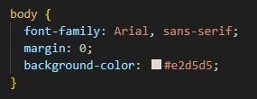

\*Selektor ini digunakan untuk mengatur beberapa tampilan untuk halaman web, didalam nya berisi atribut:

1. font-family: Arial, sans-serif;: Properti ini mengatur jenis font yang akan digunakan untuk teks dalam elemen <body>.
2. margin: 0;: Properti ini menghapus margin bawaan (ruang putih) yang ada pada elemen <body>. Biasanya, browser memberikan margin default untuk elemen <body>, dan aturan ini mengaturnya menjadi nol, sehingga halaman dimulai dari sudut kiri atas viewport tanpa ruang putih tambahan.
3. background-color: Properti ini mengatur warna latar belakang elemen <body>.

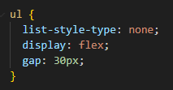

1. list-style-type: none;: Properti ini menghilangkan tanda listing (bullet atau numbering) yang biasanya muncul di depan elemen-elemen daftar. Ini umumnya digunakan untuk mengubah daftar menjadi daftar tanpa tanda.
2. display: flex;: Properti ini mengubah elemen <ul> menjadi sebuah kontainer fleksibel, yang memungkinkan pengaturan item daftar secara horizontal (sejajar) atau vertikal (bertumpuk), tergantung pada pengaturan kontainer. Ini sangat berguna untuk membuat menu navigasi horisontal di navbar.
3. gap: 30px;: Properti ini menentukan jarak (spacing) antara item daftar dalam kontainer fleksibel. Nilai 30px menentukan jarak sebesar 30 piksel antara item-item tersebut. Ini dapat membantu menciptakan ruang antara tautan navigasi dalam navbar Anda.

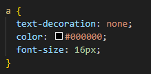

1. text-decoration: none;: Properti ini menghilangkan dekorasi tautan bawaan seperti garis bawah (underline) atau garis tepi (border) yang biasanya terlihat pada tautan. Dalam hal ini, itu menghapus garis bawah dari tautan, sehingga tautan akan terlihat sebagai teks biasa tanpa dekorasi tambahan.
2. color: #000000;: Properti ini mengatur warna teks tautan menjadi hitam (#000000). Anda dapat mengganti nilai warna sesuai dengan preferensi desain Anda.
3. font-size: 16px;: Properti ini mengatur ukuran font untuk teks tautan menjadi 16 piksel. Anda dapat mengubah ukuran font sesuai dengan preferensi desain Anda.

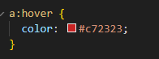

1. a:hover: Ini adalah pseudo-class CSS yang digunakan untuk menentukan tampilan tautan saat kursor berada di atasnya.
2. color: Properti ini mengubah warna teks tautan saat kursor berada di atas tautan.

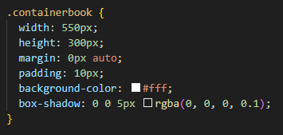

\*Selektor ini digunakan untuk mengatur tampilan pada container buku bagian pertama dengan menggunakan atribut:

1. width: 550px;: Properti ini mengatur lebar elemen .containerbook menjadi 550 piksel.
2. height: 300px;: Properti ini mengatur tinggi elemen .containerbook menjadi 300 piksel.
3. margin: 0px auto;: Properti ini mengatur margin elemen .containerbook secara horizontal menjadi nol (0px) dan secara vertikal menjadi "auto." Ini memposisikan elemen di tengah horizontal dari parentnya, biasanya di tengah tampilan browser.
4. padding: 10px;: Properti ini menambahkan jarak padding sebanyak 10 piksel di sekeliling elemen .containerbook. Padding adalah ruang kosong antara batas elemen dan kontennya.
5. background-color: Properti ini mengatur warna latar belakang elemen .containerbook.
6. box-shadow: Properti ini menambahkan efek bayangan lembut ke elemen .containerbook. Bayangan ini memberikan elemen efek tiga dimensi.

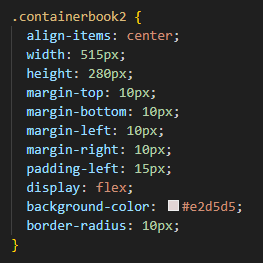

\*Selektor ini digunakan untuk mengatur tampilan pada container buku bagian kedua dengan menggunakan atribut:

1. align-items: center;: Properti ini mengatur penempatan elemen-elemen anak secara vertikal di tengah elemen yang memiliki kelas .containerbook2.
2. width: 515px;: Properti ini mengatur lebar elemen .containerbook2 menjadi 515 piksel.
3. height: 280px;: Properti ini mengatur tinggi elemen .containerbook2 menjadi 280 piksel.
4. margin-top: 10px;, margin-bottom: 10px;, margin-left: 10px;, margin-right: 10px;: Properti-properti margin ini menentukan jarak margin elemen .containerbook2 dari sisi-sisi tertentu. Dalam hal ini, elemen akan memiliki margin 10 piksel di semua sisi (atas, bawah, kiri, dan kanan).
5. padding-left: 15px;: Properti ini menambahkan jarak padding 15 piksel di sisi kiri elemen .containerbook2. Padding adalah ruang kosong antara batas elemen dan kontennya.
6. display: flex;: Ini mengatur .containerbook2 sebagai kontainer tampilan fleksibel, yang memungkinkan Anda untuk mengatur elemen-elemen anak di dalamnya dengan lebih fleksibel menggunakan CSS properti justify-content, align-items, dan lainnya yang berkaitan dengan fleksibilitas.
7. background-color: Properti ini mengatur warna latar belakang elemen .containerbook2.
8. border-radius: 10px;: Properti ini memberikan elemen sudut lengkung dengan radius 10 piksel, sehingga elemen memiliki tepi yang lembut dan tidak tajam.

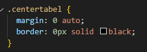

\*Selektor ini digunakan untuk mengatur elemen tabel agar terletak ditengah dengan menggunakan atribut:

1. margin: 0 auto;: Properti ini mengatur elemen dengan class .centertabel menjadi berada di tengah secara horizontal dengan menggunakan margin otomatis. Ini umumnya digunakan untuk mengatur tata letak tengah untuk elemen-elemen yang memiliki lebar yang telah ditentukan.
2. border: 0px solid black;: Properti ini mengatur elemen dengan class .centertabel untuk memiliki batas (border) dengan ketebalan 0 piksel, sehingga tidak akan ada garis batas yang terlihat.

\*Selektor ini digunakan untuk mengatur bentuk latar belakang pada form login dengan menggunakan atribut:

1. width: 290px;: Properti ini mengatur lebar elemen dengan kelas .containerform menjadi 290 piksel.
2. height: 230px;: Properti ini mengatur tinggi elemen dengan kelas .containerform menjadi 230 piksel.
3. margin: 20px auto;: Properti ini mengatur elemen .containerform untuk berada di tengah secara horizontal dengan margin atas dan bawah sebanyak 20 piksel dan margin otomatis di sisi kiri dan kanan.
4. padding: 20px;: Properti ini menambahkan jarak padding sebanyak 20 piksel di sekeliling elemen .containerform. Padding adalah ruang kosong antara batas elemen dan kontennya.
5. border-radius: 15px;: Properti ini memberikan elemen sudut lengkung dengan radius 15 piksel, sehingga elemen memiliki tepi yang lembut dan tidak tajam.
6. background-color: Properti ini mengatur warna latar belakang elemen .containerform.
7. box-shadow: Properti ini menambahkan efek bayangan lembut ke elemen .containerform. Bayangan ini memberikan elemen efek tiga dimensi.

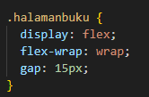

\*Selektor ini digunakan untuk mengatur letak susunan buku pada halaman buku dengan menggunakan atribut:

1. display: flex;: Properti ini mengatur elemen-elemen dengan kelas .halamanbuku sebagai kontainer tampilan fleksibel (flex container). Ini memungkinkan Anda untuk mengatur elemen-elemen anak di dalamnya dengan lebih fleksibel menggunakan properti seperti justify-content, align-items, dan lainnya yang berkaitan dengan fleksibilitas.
2. flex-wrap: wrap;: Properti ini digunakan bersama dengan display: flex; dan mengatur elemen-elemen anak agar dapat melintasi baris (wrap) jika ruang horizontal tidak mencukupi.
3. gap: 15px;: Properti ini menambahkan jarak (spacing) sebesar 15 piksel antara elemen-elemen anak di dalam kontainer .halamanbuku

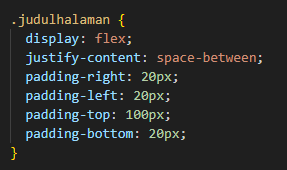

\*Selektor ini digunakan untuk mengatur letak judul halaman pada halaman buku dengan menggunakan atribut:

1. display: flex;: Properti ini mengubah elemen yang memiliki kelas .judulhalaman menjadi sebuah kontainer fleksibel
2. justify-content: space-between;: Properti ini digunakan untuk mengatur cara elemen-elemen di dalam kontainer flex ditempatkan secara horizontal.
3. padding-left: 20px;: Properti ini menambahkan jarak padding sebanyak 20 piksel di sisi kiri elemen dengan kelas .judulhalaman. Padding adalah ruang kosong antara batas elemen dan kontennya.
4. padding-top: 20px;: Properti ini menambahkan jarak padding sebanyak 20 piksel di sisi kanan elemen.
5. padding-top: 100px;: Properti ini menambahkan jarak padding sebanyak 100 piksel di sisi atas elemen.
6. padding-bottom: 20px;: Properti ini menambahkan jarak padding sebanyak 20 piksel di sisi bawah elemen.

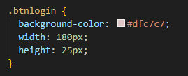

\*Selektor ini digunakan untuk mengatur bentuk button login dengan menggunakan atribut:

1. background-color: Properti ini mengatur warna latar belakang elemen dengan kelas .btnlogin.
2. width: 180px;: Properti ini mengatur lebar elemen .btnlogin menjadi 180 piksel.
3. height: 25px;: Properti ini mengatur tinggi elemen .btnlogin menjadi 25 piksel.

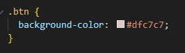

\*Selektor ini digunakan untuk mengatur bentuk button baca deskripsi yang berada didalam container buku dengan menggunakan atribut:

1. background-color: Properti ini mengatur warna latar belakang elemen dengan kelas .btn.

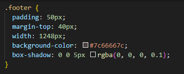

\*Selektor ini digunakan untuk mendefinisikan elemen yang digunakan dibagian akhir web, dengan menggunakan atribut:

1. width: 1248px;: Properti ini mengatur lebar elemen .footer menjadi 1248 piksel.
2. padding: 50px;: Properti ini menambahkan jarak padding sebanyak 50 piksel di sekeliling elemen .footer. Ini akan memberikan elemen footer lebih banyak ruang kosong di sekeliling kontennya.
3. margin-top: 40px;: Properti ini mengatur margin atas elemen .footer sebanyak 40 piksel. Margin atas akan memberikan jarak antara elemen ini dan elemen di atasnya.
4. background-color: Properti ini mengatur warna latar belakang elemen .footer menjadi merah muda dengan tingkat transparansi tertentu.
5. box-shadow: Properti ini menambahkan efek bayangan lembut ke elemen .footer. Bayangan ini memberikan elemen efek tiga dimensi.

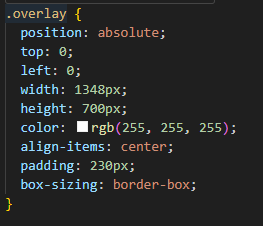

\*Selektor ini digunakan untuk membuat lapisan latar belakang yang menutupi seluruh halaman dengan menggunakan atribut:

1. position: absolute;: Properti ini mengatur elemen-elemen dengan kelas .overlay dalam posisi absolut, yang berarti elemen ini ditempatkan sesuai dengan elemen yang terdekat dengan posisi relatif.
2. top: 0;: Properti ini mengatur elemen .overlay untuk berada di bagian atas elemen yang memiliki posisi relatif terdekat.
3. left: 0;: Properti ini mengatur elemen .overlay untuk berada di sisi kiri elemen yang memiliki posisi relatif terdekat.
4. width: 1348px;: Properti ini mengatur lebar elemen .overlay menjadi 1348 piksel.
5. height: 700px;: Properti ini mengatur tinggi elemen .overlay menjadi 700 piksel.
6. color: rgb(255, 255, 255);: Properti ini mengatur warna teks dalam elemen .overlay menjadi putih (kode warna dalam format RGB).
7. align-items: center;: Properti ini mencoba mengatur penempatan elemen-elemen anak secara vertikal di tengah elemen .overlay. Namun, untuk menggunakan align-items, elemen .overlay harus memiliki tampilan fleksibel (flexbox).
8. padding: 230px;: Properti ini menambahkan jarak padding sebanyak 230 piksel di sekeliling elemen .overlay. Padding adalah ruang kosong antara batas elemen dan kontennya.
9. box-sizing: border-box;: Properti ini mengubah model kotak elemen .overlay menjadi model kotak "border-box."

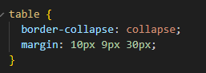

\*Selektor tabel digunakan untuk mengatur tata letak tabel pada web, didalam nya menggunakan atribut:

1. border-collapse: collapse;: Properti ini mengatur perilaku tabel untuk menggunakan model penyatuan batas (collapsed borders). Ini berarti batas sel dalam tabel akan terlihat sebagai 2. satu garis saja, dan tidak akan ada jarak antara sel.
   margin: 10px 9px 30px;: Properti ini mengatur jarak margin elemen-elemen tabel.

\*Selektor ini digunakan untuk mengatur tampilan header tabel pada web, didalam nya menggunakan atribut:

1. border: 0px solid #000000;: Properti ini mengatur elemen-elemen <th> untuk tidak memiliki batas (border) dan ketebalan batasnya adalah 0 piksel.
2. padding: 6px;: Properti ini menambahkan jarak padding sebanyak 6 piksel di sekeliling elemen-elemen <th>. Padding adalah ruang kosong antara batas elemen dan kontennya.
3. text-align: left;: Properti ini mengatur teks dalam elemen-elemen <th> untuk dipojok kiri.

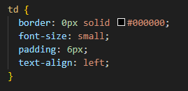

\*Selektor tabel digunakan untuk mengatur tampilan kolom data tabel pad web, didalam nya menggunakan atribut:

1. border: 0px solid #000000;: Properti ini mengatur elemen-elemen <td> untuk tidak memiliki batas (border) dan ketebalan batasnya adalah 0 piksel.
2. font-size: small;: Properti ini mengatur ukuran font elemen-elemen <td> menjadi ukuran font "small."
3. padding: 6px;: Properti ini menambahkan jarak padding sebanyak 6 piksel di sekeliling elemen-elemen <td>. Padding adalah ruang kosong antara batas elemen dan kontennya.
4. text-align: left;: Properti ini mengatur teks dalam elemen-elemen <td> untuk dipojok kiri.

**4. System Features**

4.1 Halaman Beranda
   
4.1.1 Description and Priority

   Halaman beranda merupakan fitur utama dalam website OnBook. Pada halaman ini, pengguna diminta untuk login ke dalam website agar bisa melihat ulasan buku lebih lanjut.   
   
4.1.2 Stimulus/Response Sequences

   Stimulus = Pengguna akan melihat halaman beranda yang menampilkan kolom untuk login
   Respon = Pengguna melakukan login
   
4.1.3 Functional Requirements

   Fitur Pendaftaran/Login. Website OnBook ini harus memiliki fitur pendaftaran ataupun login yang memungkinkan pengguna untuk mengakses akun mereka atau membuat akun baru.

4.2 Halaman Rekomendasi
   
4.2.1 Description and Priority

   Halaman rekomendasi adalah halaman yang menyajikan buku-buku yang direkomendasikan kepada pengguna. Halaman ini bertujuan untuk memberikan pengalaman yang personal dan relevan kepada pengguna, memungkinkan mereka menemukan buku-buku baru yang mungkin menarik dan sesuai dengan minat mereka.
   
4.2.2 Stimulus/Response Sequences

   Stimulus = Pengguna akan melihat beberapa buku rekomendasi yang sedang best seller
   Respon = Pengguna melihat informasi mengenai buku tersebut dan membaca ulasan

   Stimulus 2 = Pengguna tertarik untuk membeli buku yang telah dilihat dan dibaca
   Respon 2 = Pengguna meng-klik tombol toko buku yang kemudian diarahkan ke website gramedia untuk membelinya
   
4.2.3 Functional Requirements

   Fitur Ulasan. Fitur ulasan pada OnBook memungkinkan pengguna untuk memberikan ulasan dan peringkat buku yang telah mereka baca. Ulasan ini dapat berisi pendapat, komentar, atau tanggapan pengguna terhadap buku tertentu

4.3 Halaman Popular
   
4.3.1  Description and Priority

   Halaman populer pada website OnBook adalah halaman yang menampilkan daftar buku-buku yang saat ini paling populer atau diminati oleh pengguna. Populeritas buku ini dapat diukur berdasarkan peringkat, jumlah ulasan, penjualan, atau metrik lainnya yang relevan. 

4.3.2	Stimulus/Response Sequences

   Stimulus 1 = Pengguna melihat buku-buku yang ditampilkan pada halaman popular.
   Respon 1 = Pengguna merasa tertarik dan penasaran dengan buku-buku yang ditampilkan. Mereka mulai melihat informasi mengenai buku tersebut dan membaca ulasan.

   Stimulus 2 = Pengguna tertarik untuk membeli buku yang telah dilihat dan dibaca
   Respon 2 = Pengguna meng-klik tombol toko buku yang kemudian diarahkan ke website gramedia untuk membelinya

**5. Other Nonfunctional Requirements**

5.1 Performance Requirements
Terdapat beberapa persyaratan kinerja pada jalannya website OnBook ini :
- Website OnBook ini dapat diakses selama 24 jam selama masih tetap terhubung dengan internet.
- Server harus bisa memberikan informasi mengenai buku yang dicari user.
- Server harus bisa memberikan informasi tentang harga buku.
- Server harus bisa memberitahukan kepada user toko mana saja yang menjual buku yang dicari.

5.2 Safety Requirements
Website OnBook merupakan website dengan keamanan yang cukup baik. Kami akan memastikan website OnBook ini akan aman digunakan bagi seluruh pengguna yang mengakses website ini. Walau website ini bisa diakses oleh seluruh dunia, keamanan pengguna dipastikan dengan cukup baik. Pada login website terdapat urutan cara untuk memasukkan email dan sandinya untuk memperketat keamanan. Jadi pengguna tidak perlu khawatir dalam kecolongan data, penipuan identitas, akses dari pihak yang tidak bertanggung jawab pada website ini.

5.3 Security Requirements
Untuk persyaratan keamanan pada website OnBook ini yaitu :
- Pada bagian login dilengkapi dengan email dan kata sandi, jadi ketika pengguna mendaftar maka email dan kata sandi ini akan tertampil untuk diisi pengguna sebagai syarat keamanan yang ada.
- Server down yang terjadi pada website maksimal 24 jam.
- Keamanan terjamin karena sistem akan memastikan data-data yang sudah didaftarkan melalui email dan kata sandi yang sudah didaftarkan.
- Email dan kata sandi dapat diganti sesuai keinginan pengguna.

5.4 Software Quality Attributes
Beberapa Kualitas pada Website yang ada yaitu sebagai berikut:
- Keandalan
   Website ini dapat diakses selama 24 jam penuh asalkan tetap terhubung pada internet.
- Keamanan
   Keamanan pengguna dapat terjaga karena terdapat email dan kata sandi pribadi dari setiap user.
- Portability
   Sistem ini portable karena pengguna dan admin dapat mengakses website ini kapan saja dan dimana saja.

5.5 Business Rules
Aturan bisnis yang ada pada website OnBook ini yaitu kerjasama dengan pihak toko yang terkait. Website ini akan memberikan informasi tentang buku dan informasi toko penjual buku. Di sini bisa dibilang website OnBook ini akan mempromosikan toko yang diajak kerjasama, maka dari itulah website OnBook ini mendapatkan keuntungan. Pengguna yang sudah daftar dan login akan dapat mengakses website OnBook dengan baik.

**6. Other Requirements**

Appendix A: Glossary

Software : Perangkat lunak yang berisikan data atau file yang dapat disimpan, dibuka, dan dibaca pada komputer.
Website : Yaitu halaman informasi yang disediakan melalui jalur internet yang bisa diakses oleh seluruh dunia selama terkoneksi dengan internet.
Domain : Alamat website, yaitu dapat mengantarkan kita ke alamat website yang dituju.
Server : Merupakan sistem komputer yang memiliki layanan khusus berupa penyimpanan data.
HTML : Hypertext Markup Language merupakan bahasa yang digunakan untuk membuat struktur website ini.
CSS : Cascading Style Sheet yaitu bahasa yang digunakan untuk mengatur tampilan website OnBook ini.

Appendix B: Analysis Models

Flowchart

Use Case Diagram

Appendix C: To Be Determined List

Untuk daftar yang akan ditentukan ada beberapa yang akan dikembangkan, yaitu:

1. Kami akan mengembangkan website OnBook ini dengan menambahkan beberapa fitur untuk lebih mempermudah pengguna.
2. Kami akan memperbaiki tampilan pada website agar lebih menarik.
3. Menambah akses keamanan data pengguna yang sudah pernah login ke website OnBook.
